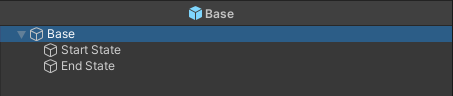
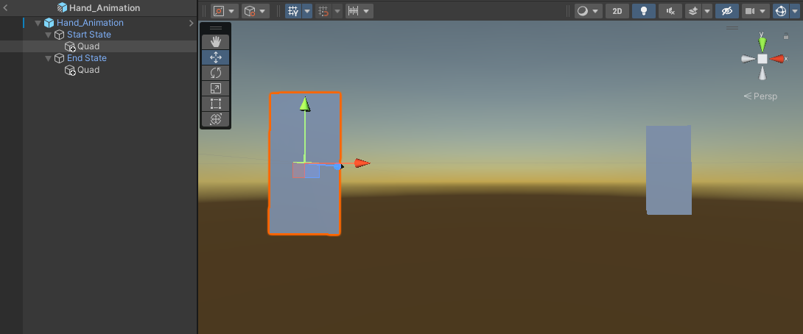
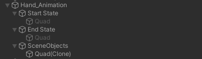
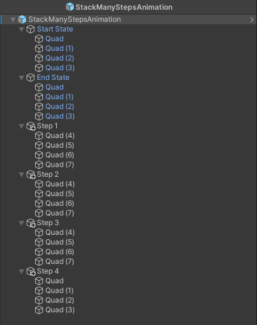

# Animation Authoring
The goal of the **Animation Authoring** project is to provide a user-friendly Unity application for quick prototyping and executing animations within a Mixed Reality Environment on the Hololens 2.

Such a system could be used to design and showcase interactions without having to develop an appropriate system for the interaction. 

For an Overview over the final Animation Prefabs look at the last chapter of this Documentation!

## Networking

This project uses Kolibri from HCI Konstanz (https://colibri.hci.uni-konstanz.de) for networking. This project is currently set up to run on the HCI Konstanz main server for testing. This server is public and available under: colibri.hci.uni-konstanz.de. The application name of this project is "MRGroupingPrototype", the exact name is irrelevant as long as it is unique and the same across all clients.

This project implements a custom network lobby script called the ColibriNetworkManager. This scripts handles creation of a lobby, one or more players joining and assigning an owner.

Colibri further allows for hosting networking solutions on private networks for this and further information on Kolibri please read their documentation.

## Scene Structure
For tracking objects to the hands of the users we use an Anchor system that relies on certain gameobjects being present in the scene. A preset for a scene-structure can be found in Prefabs > QRCode or QRCode_Networked. Both prefabs have the QR code structure set up to align a scene with a real world Environment. Both Prefabs contain the anchor objects (LeftHandAnchor, RightHandAnchor, BodyAnchor) which are required for the animation to work correctly. 

Any animation prefab should be attached to the content root for everything to function correctly. 

NOTE: After importing Photon to your project the connection between the PhotonTransformView and the PhotonView will be broken in the LeftHandAnchor, RightHandAnchor and BodyAnchor Gameobject. There is an editor script that should fix this by itself upon start of the scene but you can repair this connection manually by dragging the PhotonTransformView component on the appropriate field in the PhotonView component. 

## Animation Prefab
As part of this project, we've developed prefabs that serve two purposes: simplifying the creation of future prefabs and demonstrating various functionalities.

If you're interested in crafting your own animations or expanding existing ones, follow these steps: right-click on a prefab within the Unity editor and navigate to Create > Prefab Variant and edit this new Prefab. All the prefabs within the project are essentially variants of the "Base" prefab.

### Base Prefab Structure
For this system to function, a prefab requires a minimum of three components. The "sequence"-script component must be attached to the root of the prefab, along with two child game objects assigned to the start and end state fields of the squence-script. Additionally, the end_state game object should have the "animation_step" script attached to it. This skeleton structure is already in place within the "Base" prefab.

### Creating a Animation

With the skeleton structure in place, you're ready to craft your first animation. Begin by adding an object of the same type to both the Start State and the End State.

In the example above, two quads were included, with one being shifted backward and to the right. 

Let's look at the "Trigger" property of our End State. This property determines the animation's initiation. Currently, the project supports two triggers: "Spacebar" and "None". Selecting "Spacebar" triggers animation upon pressing the spacebar, while "None" starts the animation immediately when the animation step is called. Set the trigger to "Spacebar", launch the scene with the prefab, and hitting the spacebar should set the animation in motion, sliding the object from its initial position to the final destination.

The objects within the start and end states serve as keyframes, with their scale, rotation, and position being animated. At runtime, a new object named "SceneObjects" is created to hold the objects undergoing animation, while the keyframe-objects are deactivated.

### Animation Modifiers
Now, let's explore the other animation modifiers within an animation step. The "Animation Style" dictates how position, rotation, and scale transformations occur.

#### Animation Style
Currently, four interpolation options are available: linear, linear-to-interpolate, interpolation and interpolation-to-linear. Interpolation facilitates smooth easing in and out of the animation.
The top animation showcases the interpolated animation option, while the bottom one features linear animation.

#### Animation Duration
This property provides a slider to adjust the overall duration of an animation step in seconds.

#### Do Animate
You can deactivate an animation step by toggling the "Do Animate" property. This allows you to experiment with different animation variations within a single prefab.

### anchor
Each Object contained within an animation step has an anchor property. All of these anchors can bee seen in the inspector view of an animation step, by expanding the anchor section.  There are currently three choices for anchors, Left Hand, Right Hand and World. The origin of an prefab is tracked to either the left or right hand palm. Grouping animation objects in empty gameobjects allows for tracking of specifically arranged object groups to a tracked anchor as can be seen in the "Crashing" Prefab. 

Generally it is recommended to have a group-object which is just an empty game object to hold all the gameobjects that will be tracked to an anchor and have that group-object switch its anchor and not the child objects. This is because once a object is tracked to an anchor like the left hand it wont perform animation, by appending the group object to the anchor the children can still perform their relative animation.

### Adding Additional Animation Objects

You can incorporate more objects into a animation step. Just ensure that the order of children in the inspector remains consistent across all steps, as not the name or the type of the object is used for identification, only the order in the inspector defines which object is animated in what way. The initial child in the start state regardless of its name or type will always animate to the first child (keyframe) in following animation steps.

This animation illustrates the simultaneous animation of multiple objects.

### Adding Additional Animation Steps

This system supports additional animation steps. To achieve this, append an empty game object to the root of the prefab and attach an "Animation_Step" script to it. This new step functions like the end state. The sequence of operations always follows: Start State -> Step 1 -> ... -> Step n -> End State. Remember that the order of steps, akin to children, relies on their positioning within the inspector. Unity prevents the placement of children between the start and end states of the Base prefab.

A complex animation could be constructed as follows:

Keep in mind that the End State will be called last!

The sequence-script provides an overview of all parameters across all animation steps.
### Children of Children

This system additionally accommodates nested children, allowing nested objects to undergo animation akin to direct children of an animation step. This can be used to more easily animate groups of objects, by attaching them to a empty gameobject within the scene.

## Expanding the System

Additional animations can be implemented in the "Animations" script. Additional Triggers and the functions that describe the triggers can be implemented in the "Triggers" script. When implementing new animations or Triggers, make sure to add the option to the respective evaluation functions and Enums!

## Overview over all Prefabs

### Table Prefabs
All of these Prefabs are Prefab  Variants of the "Table_Base" Prefab. 

#### I2-A

#### I2-B

#### I2-C

#### I2-D

### Throw Merge

### Lasso Selection

### Come To Me Prefab

### Accordion

### Crash Combination

### Grid to Display

